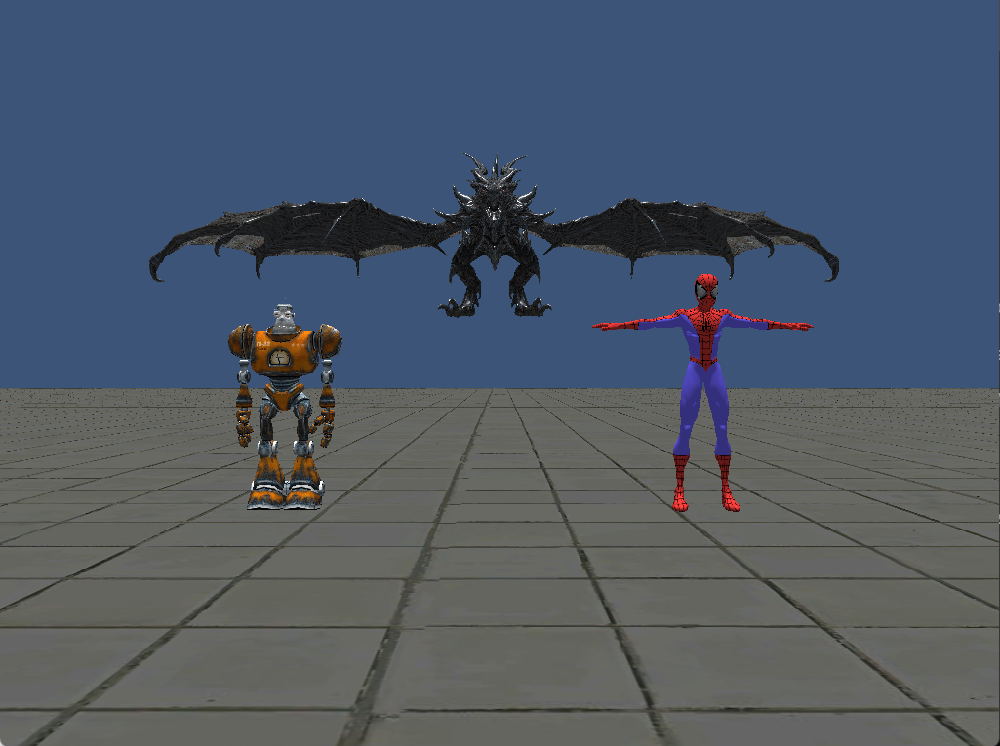

## MEMORY ALLOCATION
The purpose of this project was to write a memory allocator to load and manage OBJ models.
It is written in C/C++.

## AUTHORS
LUANDA Osvaldo Bento - (o.luanda@student.isartdigital.com)

## FEATURES
- Memory Allocation
- OBJ Parser
    

	
	 

